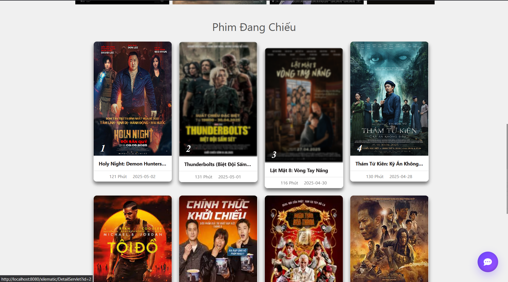

# 🎬 XILEMATIC - Movie Ticket Booking System

> Modern cinema management and online ticket booking platform

[](https://www.java.com/en/)
[](https://docs.oracle.com/javaee/5/tutorial/doc/bnajo.html)
[](https://www.google.com/url?sa=t&source=web&rct=j&opi=89978449&url=https://www.microsoft.com/en-us/sql-server/sql-server-2022&ved=2ahUKEwjWq9zw-dOQAxWhsFYBHQdeCjsQFnoECA0QAQ&usg=AOvVaw0GMh9IsvpnCnNGkalJ5yZP)
[](https://getbootstrap.com/)

[Video Demo](#)

---

## 📸 Screenshots

<p align="center">
  
  
</p>

---

## ✨ Key Features

- 🎫 **Seat Selection** - Interactive seat map
- 💳 **E-wallet Integration** - Secure payment via VNPay
- 🤖 **AI Chatbot** - Smart movie recommendations based on user preferences
- 📧 **Email Notifications** - Automated ticket confirmation emails
- 🎭 **Cinema Management** - Admin dashboard for managing theaters, movies, and showtimes
- 📊 **Analytics Dashboard** - Revenue tracking and user behavior insights

---

## 🏗️ System Architecture
```
┌─────────────┐
│   Browser   │
└──────┬──────┘
       │ HTTP
┌──────▼──────────────────┐
│   Presentation Layer    │
│  (JSP/Servlet + CSS)    │
└──────┬──────────────────┘
       │
┌──────▼──────────────────┐
│   Business Logic Layer  │
│  (Java Servlets)        │
└──────┬──────────────────┘
       │
┌──────▼──────────────────┐
│   Data Access Layer     │
│  (JDBC + DAO Pattern)   │
└──────┬──────────────────┘
       │
┌──────▼──────────────────┐
│   SQL Server Database   │
└─────────────────────────┘
```

---

## 🛠️ Tech Stack

### Backend
- **Java 21** - Core programming language
- **JSP/Servlet** - Server-side rendering and request handling
- **JDBC** - Database connectivity
- **JavaMail API** - Email service

### Frontend
- **HTML5/CSS3** - Structure and styling
- **Bootstrap 5** - Responsive UI framework
- **JavaScript** - Client-side interactivity

### Database
- **SQL Server 2022** - Relational database
- **Stored Procedures** - Complex business logic

### Third-party Services
- **VNPay API** - Payment gateway
- **Dialogflow** - Chatbot AI engine

---

## 📊 Database Schema
```sql
-- Key tables
-- Core booking flow (các bảng chính)

[HeThongRap]
     |
     v
[CumRap]
     |
     v
[RapPhim] ---------.
     |              \
     v               \
    [Ghe]             \
                       v
                  [LichChieu] <------ [Phim]
                       |
                       v
                    [DatVe] <------ [NguoiDung]


-- Giải thích nhanh:
-- HeThongRap    = Hệ thống rạp (ví dụ CGV, BHD)
-- CumRap        = Cụm rạp thuộc hệ thống
-- RapPhim       = Một rạp cụ thể
-- Ghe           = Danh sách ghế trong rạp
-- Phim          = Phim được chiếu
-- LichChieu     = Suất chiếu (rạp nào, phim nào, giờ nào)
-- NguoiDung     = Tài khoản khách hàng
-- DatVe         = Giao dịch đặt vé (ai đặt ghế nào, suất nào)
```

[View full schema →](docs/database-schema.md)

---

## 🚀 Getting Started

### Prerequisites
- Java JDK 21+
- SQL Server 2019+
- Apache Tomcat 10.0+
- Maven 3.6+

### Installation

1. **Clone the repository**
```bash
git clone https://github.com/yourusername/xilematic.git
cd Xilematic_v2
```

2. **Configure database**
```bash
# Create database
sqlcmd -S localhost -Q "CREATE DATABASE QuanLyRapChieuPhim"

# Import schema
sqlcmd -S localhost -d QuanLyRapChieuPhim -i SetupDB/SetupDB.sql

# Import sample data (optional)
sqlcmd -S localhost -d QuanLyRapChieuPhim -i SetupDB/InsertData.sql
```

3. **Update configuration**
```java
// src\main\java\config\AppConfig.java
DB_URL = "jdbc:sqlserver://localhost:1433;databaseName=QuanLyRapChieuPhim;encrypt=true;trustServerCertificate=true";
DB_USER = your_username
DB_PASS = your_password
```

4. **Build and run**
```bash
mvn clean cargo:run
```

5. **Access the application**
```
http://localhost:8080/xilematic
```


## 📁 Project Structure
```
xilematic/
├── SetupDB/
│   ├── SetupDB.sql            # DB schema
│   └── InsertData.sql         # Seed data
├── .gitignore
├── README.md
├── project-tree.txt
└── Xilematic_v2/              # Maven webapp module
    ├── pom.xml
    ├── .classpath
    ├── .project
    ├── .idea/                 # (IDE configs - consider ignoring)
    ├── .settings/             # (IDE configs)
    ├── src/
    │   └── main/
    │       ├── java/
    │       │   ├── com/
    │       │   │   └── vnpay/
    │       │   │       ├── common/
    │       │   │       │   ├── ajaxServlet.java
    │       │   │       │   ├── Config.java
    │       │   │       │   └── VnpayReturn.java
    │       │   │       ├── config/
    │       │   │       │   └── AppConfig.java
    │       │   │       ├── constant/
    │       │   │       │   └── IConstant.java, PageLink.java, SessionAttribute.java
    │       │   │       ├── context/
    │       │   │       │   └── DBConnection.java
    │       │   │       ├── controller/        # Servlets
    │       │   │       │   └── *.java
    │       │   │       ├── dao/               # Data access
    │       │   │       │   └── *DAO.java, I*.java
    │       │   │       ├── entity/            # Entity classes
    │       │   │       ├── filter/            # Filters (AuthFilter)
    │       │   │       ├── model/             # Domain models
    │       │   │       ├── service/           # Business logic
    │       │   │       └── utils/             # Utilities (Helper, SendEmail...)
    │       ├── resources/
    │       │   └── META-INF/
    │       │       └── persistence.xml
    │       └── webapp/
    │           ├── WEB-INF/
    │           │   ├── web.xml
    │           │   └── beans.xml
    │           ├── admin/                     # Admin JSPs
    │           ├── asset/
    │           │   └── image/
    │           ├── components/                # header/footer JSPs
    │           ├── home/                      # home JSPs
    │           ├── script/                    # JS files
    │           ├── style/                     # CSS files
    │           └── user/                      # User JSPs
    └── target/                                # Build artifacts (ignore in VCS)
        ├── Xilematic_v2-1.0-SNAPSHOT.war
        └── classes/
```


## 🎯 Key Learnings & Challenges

### Technical Achievements
✅ Implemented **MVC pattern** with clear separation of concerns  
✅ Built **transaction management** for concurrent seat booking  
✅ Developed **session management** for cart and user authentication  


## 🔜 Future Enhancements

- [ ] Mobile app (React Native)
- [ ] QR code for ticket validation
- [ ] Social login (Google, Facebook)
- [ ] Movie rating and review system
- [ ] Loyalty points program
- [ ] Multi-language support

---


⭐ If you found this project helpful, please give it a star!
